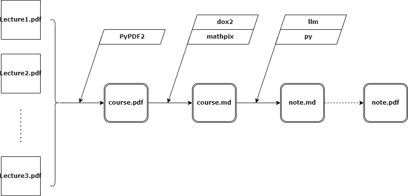

# pdf2note
## 2024/9/10
未完成,目标是实现从课程pdf一键转化为md格式笔记
- 初步想法是借助[mathpix(pdf转md工具)](https://snip.mathpix.com/),开源大语言模型的api,和一些简单的python处理逐步实现转化
- 这一这项工作似乎理应被做的很好了,但却没能搜到相关项目,于是自己动手写
- 我现在(2024秋)选修了nsd博弈论,遂以其23年笔记为第一个样例
- 当前在针对性研究mathpix的输出
#### 概览

#### 展望
- 期望动手训练pdf2md,mathpix太贵啦
